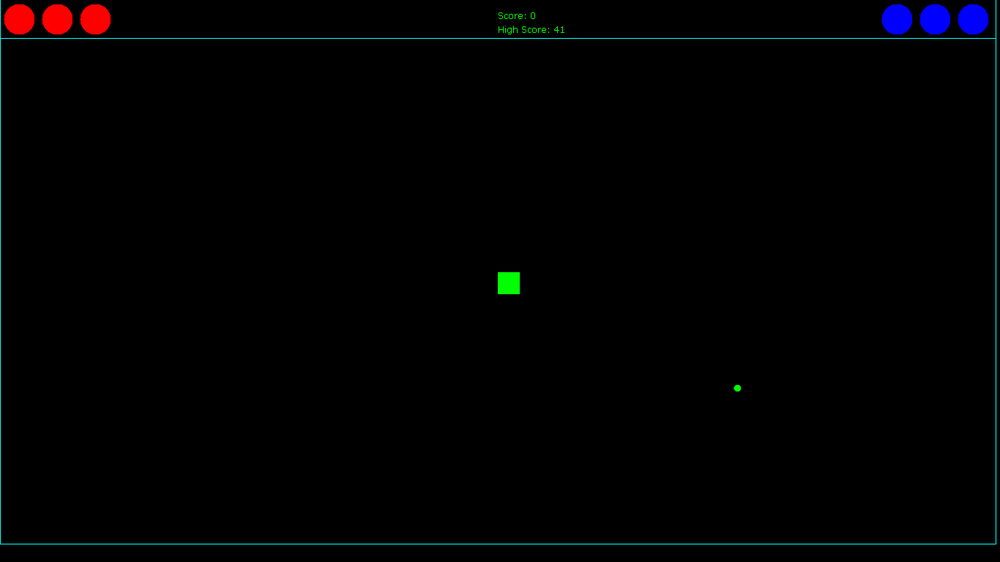

# NomNom...
A simple game I made in java for a school Science fair/project in 2017 over the course of 2 afternoons and futher refined and updated it throughout 2017 and early 2018

# Installation/Usage

- download / clone this repository in a suitable directory.
```bash
$ git clone https://github.com/AkitoshTheBold/NomNom....git
```
- run as 
```bash
$ java -jar ./NomNom.jar
```
- Enjoy!!

